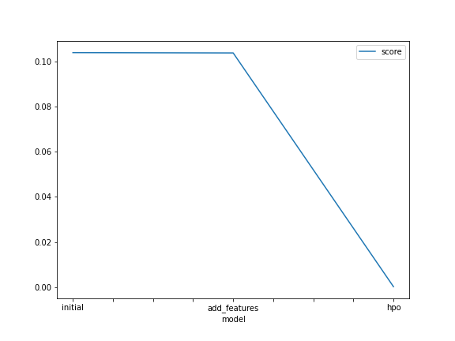
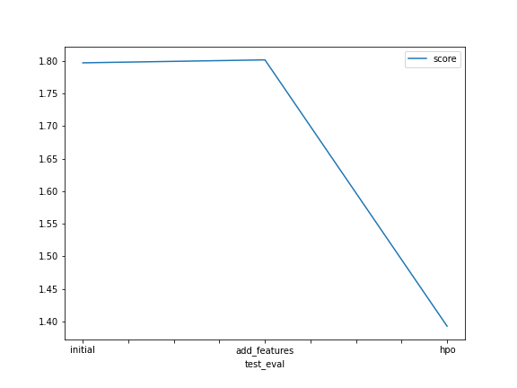

# Report: Predict Bike Sharing Demand with AutoGluon Solution
#### Oliver Turner

## Initial Training
### What did you realize when you tried to submit your predictions? What changes were needed to the output of the predictor to submit your results?
I needed to ensure that all of the output values were positive.

### What was the top ranked model that performed?
My best performing model was the hpo model, it perfromed significantly better on the test data and on the training data. I beleieve this could be to do with using the XGBoost model - a model that is very popular for kaggle competitions.
the second best was the initial model, this could be because Autogluon is very well optimised at finding regressions for tabular data - whereas I am not an expert on hyperparameter tuning.

## Exploratory data analysis and feature creation
### What did the exploratory analysis find and how did you add additional features?
The data was well cleaned and formatted from the beggining, although I needed to convert some column types from `int` to `categorical` and also needed to specify that the datetime column was a `datetime` type.
I added a specific hour and day column. This is because bike sharing demand will change over different times of day (i.e. less busy at night compared to rush hour), so this could have a large influence on the models predictive ability.

### How much better did your model preform after adding additional features and why do you think that is?
My model did not perform better on test data after adding additional features, this could be because this extra information was not neccessary given the other columns - so it just added unneccesary complexity.

## Hyper parameter tuning
### How much better did your model preform after trying different hyper parameters?
There was some improvement after tuning hyperparameters. (rmse was reduced by around 30%).
Autogluon is designed to find the best solution without hyperparameter tuning, so I wasnt expecting to make any large improvements here but i was pleasantly surprised.

### If you were given more time with this dataset, where do you think you would spend more time?
I would spend more time feature engineering, to identify the most important features and remove the unimportant ones.

### Create a table with the models you ran, the hyperparameters modified, and the kaggle score.

model	          hpo1	          hpo2	          hpo3	          score
0	hpo	          presets	      num_bag_folds	  XGB            1.39252
1	add_features default	      default	      default        1.80159
2	initial      default	      default	      default        1.79036

### the top model score for the three training runs during the project.

### the top kaggle score for the three prediction submissions during the project.

TODO: Replace the image below with your own.

## Summary
The first two models effective at reducing the error on the trainnig data but not the test data. This leads me to beleive that overfitting was taking place. There was a significant improvement on test error with the hpo model - probably due to using XGBoost algortithm.

